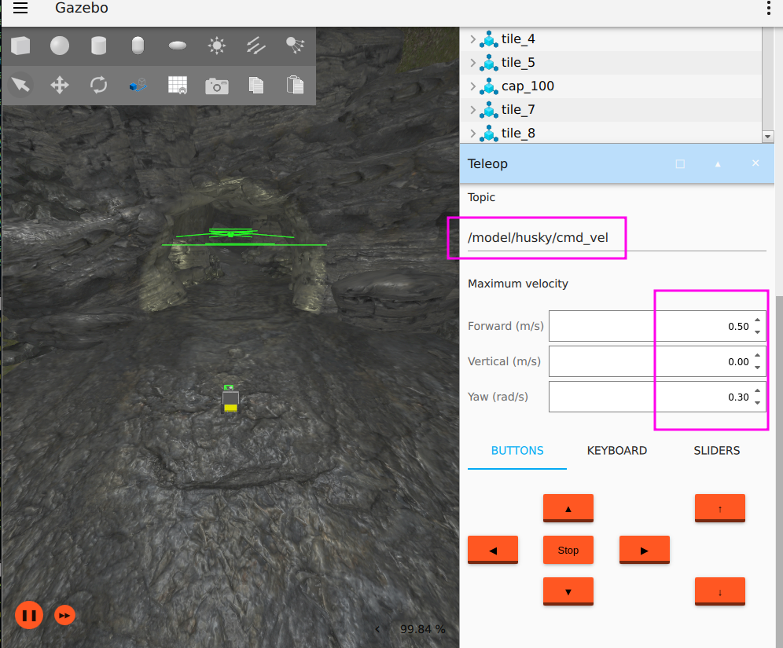
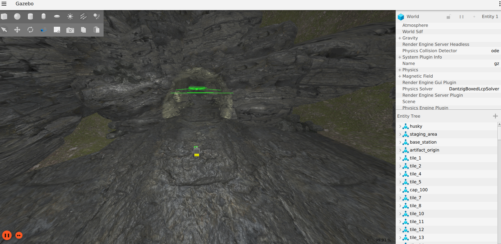
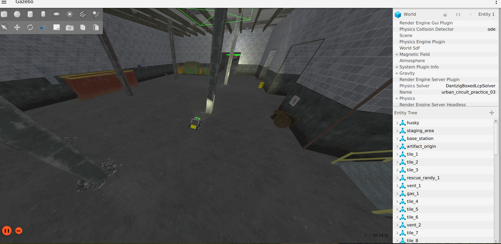

# ROS 2 Humble Test Environment with Gazebo Fortress

This provides instructions for setting up a test environment using **Gazebo Fortress** and **ROS 2 Humble**. The setup includes configurations for using the Husky robot and ensures that the necessary resources are in place for smooth operation.

## Prerequisites

### 1. Install ROS2 Humble
Ensure you have **ROS2 Humble** installed on your system. Follow the official page at [ROS2 Humble Debian Installation](https://docs.ros.org/en/humble/Installation/Ubuntu-Install-Debs.html)

### 2. Install Gazebo Fortress
If you need to install **Gazebo Fortress**, follow the instructions provided on the official page at [Gazebo Installation](https://gazebosim.org/docs/latest/ros_installation/).

### 3. Husky Configuration
To ensure that Gazebo can find the robot model, you need to export the following environment variable. Replace /path/to/ with the actual **complete** path where you clone the repository `ros2_humble_gazebo_sim`. Add this command to your terminal:
```
export IGN_GAZEBO_RESOURCE_PATH=/path/to/ros2_humble_gazebo_sim/resource:$IGN_GAZEBO_RESOURCE_PATH
```

### 4. Get ros2_humble_gazebo_sim
You can clone the repo `ros2_humble_gazebo_sim` anywhere in your system.
```
git clone https://github.com/dfki-ric/ros2_humble_gazebo_sim.git
cd ros2_humble_gazebo_sim
bash install_dependencies.bash
```

### 5. Usage
```
ros2 launch start.launch.py --show-args
Arguments (pass arguments as '<name>:=<value>'):

    'robot_name':
        Options: husky
        (default: 'husky')

    'world_file_name':
        Options: cave_circuit, urban_circuit_practice_03
        (default: 'cave_circuit')

    'use_joystick':
        Use a real joystick.
        (default: 'False')

    'joy_config_file':
        Full path to the joy config
        (default: 'joy_config_file')

    'teleop_twist_config_file':
        Full path to the teleop twist joy config
        (default: 'teleop_twist_config_file')

```

#### Robot Control

You can use the `Teleop` plugin of Gazebo for sending velocity commands to the robot. Click on the three dots in top-right corner of Gazebo window and search for `Teleop`. Select the plugin and adjust the values as shown in figure.



Alternative to the `Teleop` plugin, you can use a joystick for moving the robot. For this, set the argument `use_joystick:=True`. Adjust the config files in the folder `/config` of the `ros2_humble_gazebo_sim` package from Step 3. Provide the full paths to the arguments `joy_config_file` and `teleop_twist_config_file` as shown below:

```
ros2 launch start.launch.py use_joystick:=True joy_config_file:=/your_ros2_workspace/ros2_humble_gazebo_sim/simulation/config/joy_config.yaml teleop_twist_config_file:=/your_ros2_workspace/ros2_humble_gazebo_sim/simulation/config/teleop_twist_config.yaml
```

#### Cave Circuit


#### Urban Circuit Practice 03


#### Available Topics

```
ros2 topic list

/clock
/husky/cmd_vel
/husky/odometry
/husky/scan/points
/parameter_events
/rosout
/tf
```


# References
1) https://app.gazebosim.org/MechaKim2/fuel/worlds/Cave%20Circuit
2) https://app.gazebosim.org/OpenRobotics/fuel/worlds/Urban%20Circuit%20Practice%2003
3) https://app.gazebosim.org/OpenRobotics/fuel/models/COSTAR_HUSKY_SENSOR_CONFIG_1


